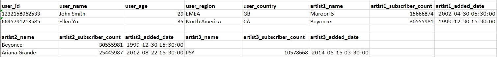

# Create a simple SQL database

Imagine you're working as a data scientist for an app where fans can subscribe to their favorite artists. Given the app has the below raw data,
create a simple SQL database that is in third normal form by creating relevant tables. Make sure you use the most
appropriate data types when creating those tables.

# Instructions

# Code
CREATE TABLE users (
 user_id text,
 user_name text
);
