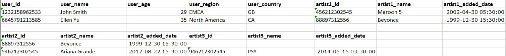

# Create a simple SQL database

Imagine you're working as a data scientist for an app where fans can subscribe to their favorite artists. Given the app has the below raw data,
create a simple SQL database that is in third normal form by creating relevant tables. Make sure you use the most
appropriate data types when creating the tables.



# Instructions
1. You need to create 4 different tables to be in third normal form.
2. You need to use 5 different data types. For example, varchar(255) will be considered different data type from varchar(2).

# Code
```sql
CREATE TABLE users (
 user_id bigint, user_name varchar(255), user_age int, user_country varchar(2)
);

CREATE TABLE country_region_mappings (
 country varchar(2), region varchar(255)
);

CREATE TABLE artists (
 artist_id bigint, artist_name varchar(255), artist_added_date date
);

CREATE TABLE user_artist_mappings (
 user_id bigint, artist_id bigint
);
```
